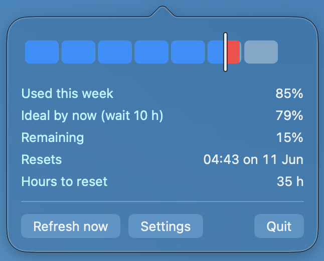
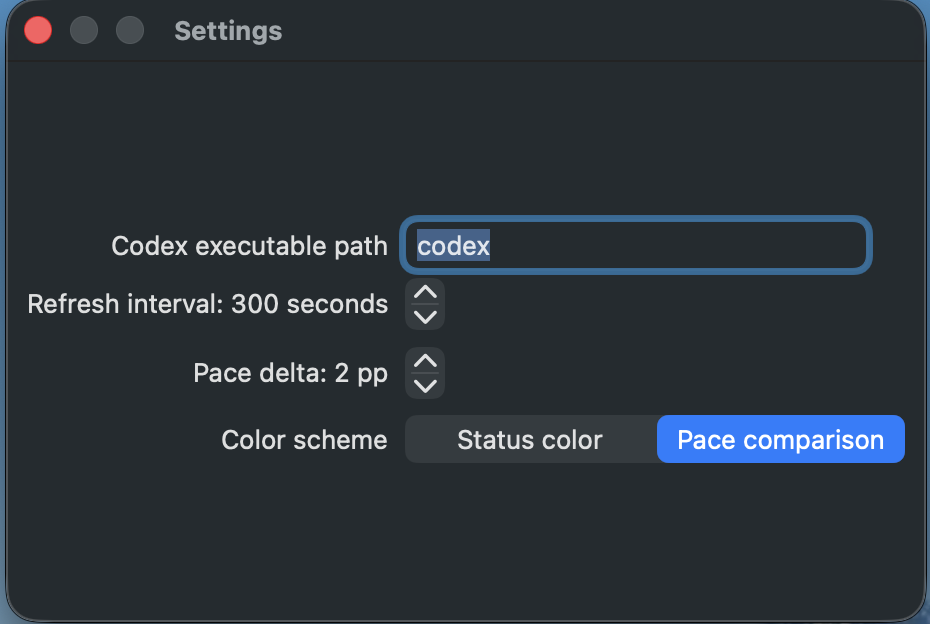

# Codex Pace Bar

Unofficial macOS menu bar app that shows whether your Codex weekly usage is below pace, on pace, or above pace.



Codex Pace Bar answers one question at a glance: are you using your weekly Codex limit faster or slower than the current reset window pace?

## Status

This is an early local-first app. It is not signed, notarized, or distributed as a packaged release yet.

The Codex app-server API is experimental and may change. If the rate-limit response shape changes, this app may need updates.

## Requirements

- macOS 15.0 or newer.
- Swift 6 toolchain / Xcode command line build tools.
- Codex CLI installed and already logged in.
- A Codex app-server that supports `codex app-server --listen stdio://`.

## What It Shows

- Seven visual segments representing the full weekly limit window.
- Filled usage based on Codex rate-limit data.
- A vertical pace marker based on exact elapsed time in the current reset window.
- A popover with used, ideal, remaining, reset time, and hours until reset.
- If usage is above pace, the popover shows how long to wait for the ideal pace to catch up.


## Settings



Settings are intentionally small:

- Codex executable path.
- Refresh interval.
- Pace delta threshold.
- Bar color scheme.

Settings are stored in `UserDefaults`.

## Build And Run

This project is intentionally shell-built. It does not require creating or opening an Xcode project.

```bash
./script/build_and_run.sh --verify
```

The script builds the SwiftPM executable, stages `dist/Codex Pace Bar.app`, launches it, and verifies that the process is running.

Run tests with:

```bash
DEVELOPER_DIR=/Applications/Xcode.app/Contents/Developer swift test
```

Depending on your local Swift toolchain setup, `DEVELOPER_DIR` may not be needed.

## Package DMG

Create a local unsigned DMG for GitHub Releases:

```bash
./script/package_dmg.sh
```

The script builds the app in release mode and writes `dist/CodexPaceBar.dmg`.

## Privacy

Codex Pace Bar is local-only.

- No analytics.
- No telemetry.
- No external backend.
- No network calls from this app.
- No OpenAI credentials are requested or stored.
- Account and rate-limit data is read only through the local Codex app-server using your existing Codex session.

Debug information is redacted and limited to operational details such as selected executable path, app-server status, detected window durations, percentage values, reset timestamp presence, errors, and timestamps.

## Unofficial Project

Codex Pace Bar is an unofficial third-party project. It is not affiliated with, endorsed by, sponsored by, or maintained by OpenAI.

Codex, OpenAI, and related names are trademarks or registered trademarks of their respective owners.

## Limitations

- The app depends on Codex's local app-server interface.
- The app-server API is experimental.
- The app currently targets macOS 15.0+.
- The app is unsigned and not notarized.
- There is no packaged release workflow yet.

## License

MIT. See [LICENSE](LICENSE).
