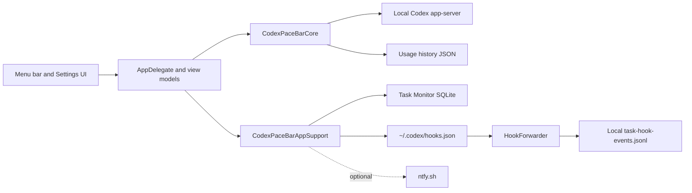

# Architecture

Codex Pace Bar is a local-first macOS menu-bar app. The main pace bar reads the local Codex app-server, while the optional Task Monitor reads bounded session-log metadata and stores its own local activity database.

## Data flow

## Task Monitor boundaries

- Session discovery checks the root directory and date folders for the configured retention window; it does not recursively enumerate the entire sessions tree.
- At most 12 recent `.jsonl` files are attached, and files larger than 2 MB are ignored during discovery.
- Discovery runs on a utility-priority detached task; watcher callbacks and UI state updates return to the main actor only after discovery completes.
- Initial log reads are tail-bounded by `CodexSessionLogReader`.
- SQLite task activity is retained for 30 days; daily check-ins are retained for 90 days.
- The Task Monitor delete action removes tasks, status events, check-ins, and checkpoints the SQLite WAL.

## Ownership and concurrency

`CodexPaceBarCore` contains parsers, models, forecasting, and local repositories. `CodexPaceBarAppSupport` owns settings, hook installation, SQLite storage, notification delivery, and monitor coordination. The app target owns AppKit/SwiftUI presentation. The hook forwarder is a separate executable so Codex can invoke it without starting the full UI app.

The SQLite store is an actor. File and directory watchers use utility queues and send parsed events back to the main actor, while UI models coalesce reloads to avoid overlapping reads.
